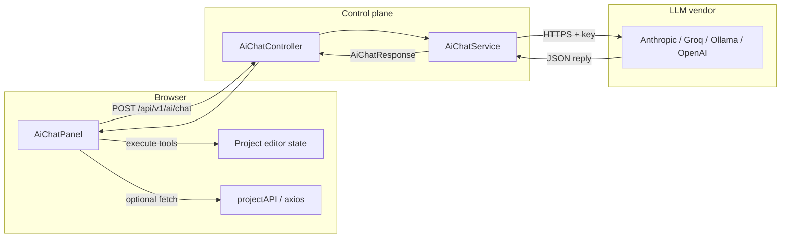

# Project editor AI assistant

The Flow Deck project editor includes an AI coding assistant in a side panel. It helps with Airflow DAGs, Python, plugins, contracts, and project files. The assistant can **list files**, **read files**, and **write files** in the current project (writes update the open editor and mark the file as modified until you save).

## How it works

### Architecture at a glance

The UI does **not** call Anthropic, Groq, or OpenAI directly from the browser. The browser talks only to your **control plane** (`/api/v1/ai/...`). The control plane holds (or receives) API keys and forwards requests to the vendor’s HTTP API. Tool execution (reading the project tree, file contents, applying edits) runs **in the browser** against your existing authenticated project APIs, then results are sent back through the control plane to the model.

### One user message, end-to-end

1. You type in the panel and send. The panel appends a **user** message to in-memory history (plain string `content` for normal text).
2. The panel calls `POST /api/v1/ai/chat` with:
   - `messages` — full history the model should see (see [Message format](#message-format-unified-for-ui-and-backend) below).
   - `fileContent` / `fileName` — optional snapshot of the **currently active tab** so the model knows what you have open (the server also injects a truncated copy into the **system** prompt).
   - `userApiKey`, `userProvider`, `userModel` — optional overrides from `localStorage` (gear settings).
   - `useTools: true` — asks the server to attach tool definitions (`list_files`, `read_file`, `write_file`).
3. `AiChatService` picks **provider** and **API key**: browser overrides win; otherwise `application.yml` / env defaults. **Ollama** is allowed with an empty key.
4. The service calls either:
   - **Anthropic** `POST https://api.anthropic.com/v1/messages`, or  
   - **OpenAI-compatible** `POST {baseUrl}/chat/completions` (Groq, Ollama, OpenAI, or any compatible host configured under `ai.openai-compatible.base-url`).
5. The HTTP response is normalized into `AiChatResponse`: either a final **`reply`** (`stopReason: "end_turn"`) or **`toolCalls`** (`stopReason: "tool_use"`) plus **`assistantContent`** (raw assistant blocks for history replay).

### Frontend-driven tool loop (agent)

When `stopReason` is `tool_use`, the panel does **not** show the reply as finished text. Instead it:

1. Appends an **assistant** message whose `content` is exactly `assistantContent` from the server (so the next model call sees the same tool-use blocks the API emitted).
2. For each `toolCalls[]` entry, runs the tool **locally**:
   - `list_files` — uses the `files` prop already loaded in the editor.
   - `read_file` — uses in-memory `fileContents` or falls back to `projectAPI.getFiles`.
   - `write_file` — calls `onApplyFileChange(fileId, content)` so React state updates the buffer and dirty flag (same as typing in CodeMirror).
3. Appends a **user** message whose `content` is an array of `{ type: "tool_result", tool_use_id, content }` blocks (Anthropic-style), one per tool.
4. Calls `POST /api/v1/ai/chat` again with the extended history.

This repeats until `stopReason` is `end_turn` or an error, or until an internal iteration cap (safety). The model never receives your Groq/Anthropic key from the tool step; it only sees **string results** of tools.

### Message format (unified for UI and backend)

The frontend and backend agree on an **Anthropic-shaped** message list in JSON, even when the upstream provider is OpenAI-compatible:

| Role | Typical `content` |
|------|-------------------|
| `user` | String (your prompt), or an array of `tool_result` objects after tools ran. |
| `assistant` | String, or an array mixing `text` and `tool_use` blocks (ids + name + `input` map). |

For **OpenAI-compatible** providers, `AiChatService` converts that history to `chat/completions` format (system message, `tool` role messages, `tool_calls` on assistant messages) and converts the response back so the UI always gets the same `AiChatResponse` shape.

### System prompt and context trimming

- **System** text is built in `AiChatService`: short Airflow-focused instructions plus, if `fileContent` is present, a fenced snippet of the open file **truncated** (character cap) to limit tokens.
- **History** is trimmed on the server to the **last 8** `messages` entries before each outbound call, to reduce rate-limit pressure on free tiers.
- On **HTTP 429**, the service may **sleep** using a delay parsed from the error body (e.g. Groq’s “try again in Xs”) and **retry once** for OpenAI-compatible POSTs (and similarly for Anthropic).

### Keys and trust boundaries

| Source | Used for |
|--------|-----------|
| `userApiKey` in request body | Overrides server key for that request (from browser gear / setup). |
| `ai.anthropic.api-key` / `ai.openai-compatible.api-key` | Server default when the browser sends no override (except Ollama). |

The control plane is the only component that must reach the public LLM APIs. Your **project file contents** in tool results flow: browser → control plane → vendor in the **next** chat request as part of `messages`, so treat the control plane and TLS policy accordingly.

### UI integration (`ProjectCodeEditor`)

- **Toggle**: `aiPanelOpen` state; robot button on `ProjectToolbar`.
- **Visibility**: `aiEnabled` from `GET /api/v1/ai/status` (`enabled` is always true when the endpoint exists; `serverKeyConfigured` reflects whether either server-side key is set).
- **Props passed into `AiChatPanel`**: `projectId`, `files`, `fileContents`, active file name/content, `onApplyFileChange` (updates editor state + modified set), `serverKeyConfigured`.

## Opening the panel

1. Open a project in the editor (`Projects` → open project).
2. In the toolbar, click the **robot** button to show or hide the AI panel.
3. The panel sits in a resizable column on the right (drag the splitter to resize).

## First-time setup (browser)

If the control plane has **no** API key configured for your chosen provider, the panel shows a short setup screen:

- Pick a **provider** (Groq, Ollama, Anthropic, or OpenAI).
- Enter an **API key** when required (Groq, Anthropic, OpenAI). **Ollama** does not need a key if it runs on your machine.
- Click **Save & start chatting**.

Settings are stored only in this browser under the key `ai_provider_config` in `localStorage` (JSON: `provider`, `apiKey`, `model`).

After setup, use the **gear** icon in the panel header to change provider, key, or model.

## Server-side configuration (optional)

Operators can configure defaults in `control-plane/src/main/resources/application.yml` (or override with environment variables).

| Area | YAML path | Environment variables (examples) |
|------|-----------|-------------------------------------|
| Default provider | `ai.provider` | `AI_PROVIDER` — `groq`, `anthropic`, `ollama`, `openai` |
| Anthropic | `ai.anthropic.api-key`, `ai.anthropic.model`, `ai.anthropic.max-tokens` | `ANTHROPIC_API_KEY` |
| OpenAI-compatible (Groq, Ollama, OpenAI, etc.) | `ai.openai-compatible.base-url`, `api-key`, `model`, `max-tokens` | `AI_OPENAI_BASE_URL`, `AI_OPENAI_API_KEY`, `AI_OPENAI_MODEL` |

Groq’s OpenAI-compatible base URL is `https://api.groq.com/openai/v1`. Ollama’s is typically `http://localhost:11434/v1` when running locally.

When **any** server-side key is set (`ai.anthropic.api-key` or `ai.openai-compatible.api-key`), `GET /api/v1/ai/status` returns `serverKeyConfigured: true`. The UI can then skip forcing a personal key for Groq if you use the server default.

## API (control plane)

Base path: `/api/v1/ai`

| Method | Path | Purpose |
|--------|------|---------|
| `GET` | `/status` | `{ "enabled": true, "serverKeyConfigured": boolean }` |
| `POST` | `/chat` | Send one chat turn; may return tool calls for the client to execute and send back |

The chat endpoint accepts a JSON body aligned with `AiChatRequest` (messages, optional `fileContent` / `fileName`, optional `userApiKey`, `userProvider`, `userModel`, `useTools`). The frontend builds conversation history and runs the **tool loop** (assistant requests tools → UI runs them against project APIs → results appended → next model call).

## Tooling (agent behaviour)

With tools enabled, the model may call:

| Tool | Behaviour |
|------|-----------|
| `list_files` | Lists project files from the editor’s in-memory tree. |
| `read_file` | Reads content by path (cached editor content or project API). |
| `write_file` | Replaces a file’s content in the editor (same as editing manually). |

Always **review** AI-written code and **save** when you are satisfied.

## Rate limits (Groq free tier)

Groq applies **tokens per minute (TPM)** limits that vary by model and account tier. The backend reduces payload size (trimmed history, shorter file context, lower `max-tokens`) and may **retry once** after a `429` response using the delay suggested in the error body. If limits persist, use a different model in the gear settings, add your own Groq key, or upgrade your Groq plan.

## Security notes

- Do **not** commit real API keys into `application.yml`. Use environment variables or a secrets manager.
- User-supplied keys in the browser are **only** in `localStorage` for that origin; they are sent to your control plane over HTTPS in normal deployments—ensure TLS and trust boundaries match your policy.

## Related code (for contributors)

| Piece | Location |
|-------|----------|
| REST controller | `control-plane/.../controller/AiChatController.java` |
| Provider routing & HTTP | `control-plane/.../service/AiChatService.java` |
| DTOs | `control-plane/.../dto/AiChatRequest.java`, `AiChatResponse.java` |
| Frontend panel | `frontend/src/components/ProjectCodeEditor/AiChatPanel.js` |
| Styles | `frontend/src/components/ProjectCodeEditor/AiChatPanel.css` |
| API client | `frontend/src/services/api.js` (`aiAPI`) |
| Editor integration | `frontend/src/pages/ProjectCodeEditor.js` (toolbar toggle, `AiChatPanel` props) |
